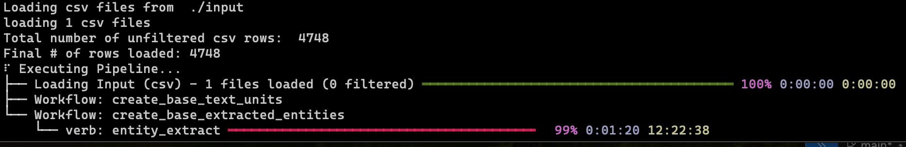

# Getting Started

⚠️ GraphRAG can consume a lot of LLM resources! We strongly recommend starting with the tutorial dataset here until you understand how the system works, and consider experimenting with fast/inexpensive models first before committing to a big indexing job.

## Requirements

[Python 3.10-3.12](https://www.python.org/downloads/)

To get started with the GraphRAG system, you have a few options:

👉 [Install from pypi](https://pypi.org/project/graphrag/). <br/>
👉 [Use it from source](developing.md)<br/>

The following is a simple end-to-end example for using the GraphRAG system, using the install from pypi option.

It shows how to use the system to index some text, and then use the indexed data to answer questions about the documents.

# Install GraphRAG

```bash
pip install graphrag
```

# Running the Indexer

To initialize your workspace, first run the `graphrag init` command.

```sh
graphrag init
```

This will create two files, `.env` and `settings.yaml`, and a directory `input`, in the current directory.

- `input` Location of text files to process with `graphrag`.
- `.env` contains the environment variables required to run the GraphRAG pipeline. If you inspect the file, you'll see a single environment variable defined,
  `GRAPHRAG_API_KEY=<API_KEY>`. Replace `<API_KEY>` with your own OpenAI or Azure API key.
- `settings.yaml` contains the settings for the pipeline. You can modify this file to change the settings for the pipeline.

### Downloading Sample Text

Get a copy of A Christmas Carol by Charles Dickens from a trusted source:

```sh
curl https://www.gutenberg.org/cache/epub/24022/pg24022.txt -o ./input/book.txt
```

## Set Up Your Workspace Variables

### Using OpenAI

If running in OpenAI mode, you only need to update the value of `GRAPHRAG_API_KEY` in the `.env` file with your OpenAI API key.

### Using Azure OpenAI

In addition to setting your API key, Azure OpenAI users should set the variables below in the settings.yaml file. To find the appropriate sections, just search for the `models:` root configuration; you should see two sections, one for the default chat endpoint and one for the default embeddings endpoint. Here is an example of what to add to the chat model config:

```yaml
type: chat
model_provider: azure
api_base: https://<instance>.openai.azure.com
api_version: 2024-02-15-preview # You can customize this for other versions
```

Most people tend to name their deployments the same as their model - if yours are different, add the `deployment_name` as well.

#### Using Managed Auth on Azure

To use managed auth, edit the auth_type in your model config and *remove* the api_key line:

```yaml
auth_type: azure_managed_identity # Default auth_type is is api_key
```

You will also need to login with [az login](https://learn.microsoft.com/en-us/cli/azure/authenticate-azure-cli) and select the subscription with your endpoint.

## Running the Indexing pipeline

Finally we'll run the pipeline!

```sh
graphrag index
```



This process will take some time to run. This depends on the size of your input data, what model you're using, and the text chunk size being used (these can be configured in your `settings.yaml` file).
Once the pipeline is complete, you should see a new folder called `./output` with a series of parquet files.

# Using the Query Engine

Now let's ask some questions using this dataset.

Here is an example using Global search to ask a high-level question:

```sh
graphrag query "What are the top themes in this story?"
```

Here is an example using Local search to ask a more specific question about a particular character:

```sh
graphrag query \
"Who is Scrooge and what are his main relationships?" \
--method local
```

Please refer to [Query Engine](query/overview.md) docs for detailed information about how to leverage our Local and Global search mechanisms for extracting meaningful insights from data after the Indexer has wrapped up execution.

# Going Deeper

- For more details about configuring GraphRAG, see the [configuration documentation](config/overview.md).
- To learn more about Initialization, refer to the [Initialization documentation](config/init.md).
- For more details about using the CLI, refer to the [CLI documentation](cli.md).
- Check out our [visualization guide](visualization_guide.md) for a more interactive experience in debugging and exploring the knowledge graph.
