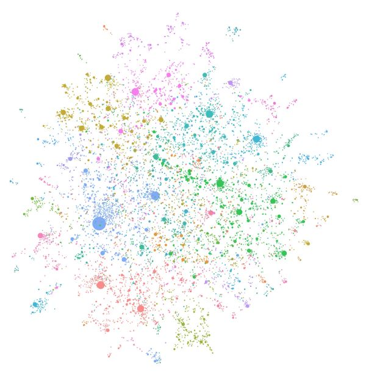

# 欢迎使用 GraphRAG

👉 [Microsoft Research 博客文章](https://www.microsoft.com/en-us/research/blog/graphrag-unlocking-llm-discovery-on-narrative-private-data/)  
👉 [GraphRAG Arxiv](https://arxiv.org/pdf/2404.16130)

图 1：使用 GPT-4 Turbo 构建的由 LLM 生成的知识图谱。

GraphRAG 是一种结构化、分层式的 Retrieval Augmented Generation (RAG) 方法，与使用纯文本片段的朴素语义搜索方法不同。GraphRAG 流程包括从原始文本中提取知识图谱、构建社区层级、为这些社区生成摘要，然后在执行基于 RAG 的任务时利用这些结构。

要进一步了解 GraphRAG 及其如何用于增强你的语言模型对私有数据的推理能力，请访问 [Microsoft Research 博客文章](https://www.microsoft.com/en-us/research/blog/graphrag-unlocking-llm-discovery-on-narrative-private-data/)。

## 开始使用 GraphRAG 🚀

要开始使用 GraphRAG，请查看 [_Get Started_](get_started.md) 指南。
若想更深入了解主要子系统，请访问 [Indexer](index/overview.md) 和 [Query](query/overview.md) 包的文档页面。

## GraphRAG 与基线 RAG 对比 🔍

Retrieval-Augmented Generation (RAG) 是一种使用现实世界信息改进 LLM 输出的技术。这项技术是大多数基于 LLM 工具的重要组成部分，而绝大多数 RAG 方法使用向量相似度作为搜索技术，我们将其称为 _Baseline RAG_。GraphRAG 使用知识图谱，在针对复杂信息进行推理时，显著提升问答性能。RAG 技术已显示出帮助 LLM 对 _私有数据集_ 进行推理的潜力——这些数据是 LLM 未经过训练且此前从未见过的数据，例如企业的专有研究、业务文档或通信内容。_Baseline RAG_ 正是为帮助解决这一问题而创建的，但我们观察到在某些情况下，基线 RAG 的表现非常差。例如：

- Baseline RAG 很难将线索串联起来。当回答一个问题需要通过共享属性遍历彼此分散的信息片段，从而提供新的综合洞见时，就会出现这种情况。
- 当被要求对大型数据集合，甚至单个大型文档中的已总结语义概念进行整体理解时，Baseline RAG 表现不佳。

为了解决这个问题，技术社区正在努力开发扩展和增强 RAG 的方法。Microsoft Research 的新方法 GraphRAG 会基于输入语料创建知识图谱。该图谱连同社区摘要和图机器学习输出，会在查询时用于增强提示。GraphRAG 在回答上述两类问题时表现出显著提升，展现出优于此前应用于私有数据集的其他方法的智能性或掌握程度。

## GraphRAG 流程 🤖

GraphRAG 基于我们先前使用图机器学习开展的 [研究](https://www.microsoft.com/en-us/worklab/patterns-hidden-inside-the-org-chart) 和 [工具](https://github.com/graspologic-org/graspologic)。GraphRAG 流程的基本步骤如下：

### 索引

- 将输入语料切分为一系列 TextUnits，它们作为后续流程中可分析的单元，并在输出中提供细粒度引用。
- 从 TextUnits 中提取所有实体、关系和关键主张。
- 使用 [Leiden technique](https://arxiv.org/pdf/1810.08473.pdf) 对图进行层次聚类。若想直观查看，请参见上面的图 1。每个圆圈都是一个实体（例如人物、地点或组织），其大小表示实体的度，颜色表示其所属社区。
- 自底向上生成每个社区及其组成部分的摘要。这有助于对数据集进行整体理解。

### 查询

在查询时，这些结构会用于为 LLM 上下文窗口提供回答问题所需的材料。主要查询模式包括：

- 使用社区摘要对语料进行整体性问题推理的 [_Global Search_](query/global_search.md)。
- 通过扩展到特定实体的邻居及相关概念来进行推理的 [_Local Search_](query/local_search.md)。
- 通过扩展到特定实体的邻居及相关概念，并加入社区信息这一额外上下文来进行推理的 [_DRIFT Search_](query/drift_search.md)。
- _Basic Search_，适用于你的查询最好由基线 RAG 回答的情况（标准 top _k_ 向量搜索）。

### 提示词调优

直接开箱即用地将 _GraphRAG_ 应用于你的数据，可能无法获得最佳结果。
我们强烈建议你按照文档中的 [Prompt Tuning Guide](prompt_tuning/overview.md) 对提示词进行微调。

## 版本控制

有关我们项目版本控制方法的说明，请参阅 [breaking changes](https://github.com/microsoft/graphrag/blob/main/breaking-changes.md) 文档。

*请务必在每次次版本号升级之间运行 `graphrag init --root [path] --force`，以确保你拥有最新的配置格式。如果你希望避免重新索引先前的数据集，请在主版本号升级之间运行提供的迁移 notebook。请注意，这将覆盖你的配置和提示词，因此如有必要请提前备份。*