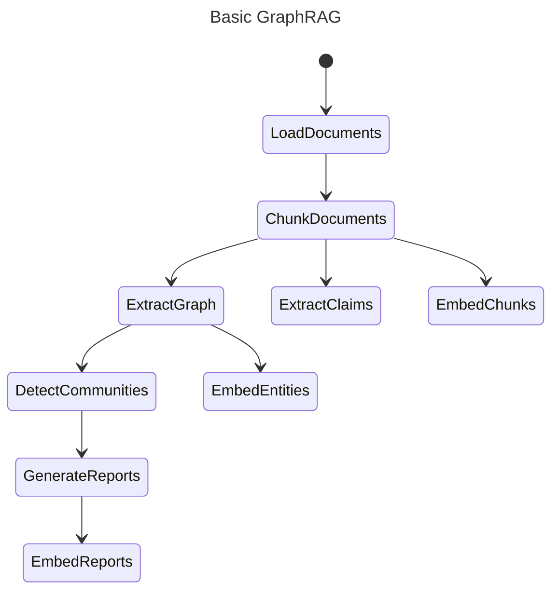

# Indexing Architecture 

## Key Concepts

### Knowledge Model

In order to support the GraphRAG system, the outputs of the indexing engine (in the Default Configuration Mode) are aligned to a knowledge model we call the _GraphRAG Knowledge Model_.
This model is designed to be an abstraction over the underlying data storage technology, and to provide a common interface for the GraphRAG system to interact with.

### Workflows

Below is the core GraphRAG indexing pipeline. Individual workflows are described in detail in the [dataflow](./default_dataflow.md) page.

### LLM Caching

The GraphRAG library was designed with LLM interactions in mind, and a common setback when working with LLM APIs is various errors due to network latency, throttling, etc..
Because of these potential error cases, we've added a cache layer around LLM interactions.
When completion requests are made using the same input set (prompt and tuning parameters), we return a cached result if one exists.
This allows our indexer to be more resilient to network issues, to act idempotently, and to provide a more efficient end-user experience.

### Providers & Factories

Several subsystems within GraphRAG use a factory pattern to register and retrieve provider implementations. This allows deep customization to support your own implementations of models, storage, and so on that we haven't built into the core library.

The following subsystems use a factory pattern that allows you to register your own implementations:

- [language model](https://github.com/microsoft/graphrag/blob/main/graphrag/language_model/factory.py) - implement your own `chat` and `embed` methods to use a model provider of choice beyond the built-in LiteLLM wrapper
- [input reader](https://github.com/microsoft/graphrag/blob/main/graphrag/index/input/factory.py) - implement your own input document reader to support file types other than text, CSV, and JSON
- [cache](https://github.com/microsoft/graphrag/blob/main/graphrag/cache/factory.py) - create your own cache storage location in addition to the file, blob, and CosmosDB ones we provide
- [logger](https://github.com/microsoft/graphrag/blob/main/graphrag/logger/factory.py) - create your own log writing location in addition to the built-in file and blob storage
- [storage](https://github.com/microsoft/graphrag/blob/main/graphrag/storage/factory.py) - create your own storage provider (database, etc.) beyond the file, blob, and CosmosDB ones built in
- [vector store](https://github.com/microsoft/graphrag/blob/main/graphrag/vector_stores/factory.py) - implement your own vector store other than the built-in lancedb, Azure AI Search, and CosmosDB ones built in
- [pipeline + workflows](https://github.com/microsoft/graphrag/blob/main/graphrag/index/workflows/factory.py) - implement your own workflow steps with a custom `run_workflow` function, or register an entire pipeline (list of named workflows)

The links for each of these subsystems point to the source code of the factory, which includes registration of the default built-in implementations. In addition, we have a detailed discussion of [language models](../config/models.md), which includes and example of a custom provider, and a [sample notebook](../examples_notebooks/custom_vector_store.ipynb) that demonstrates a custom vector store.

All of these factories allow you to register an impl using any string name you would like, even overriding built-in ones directly.