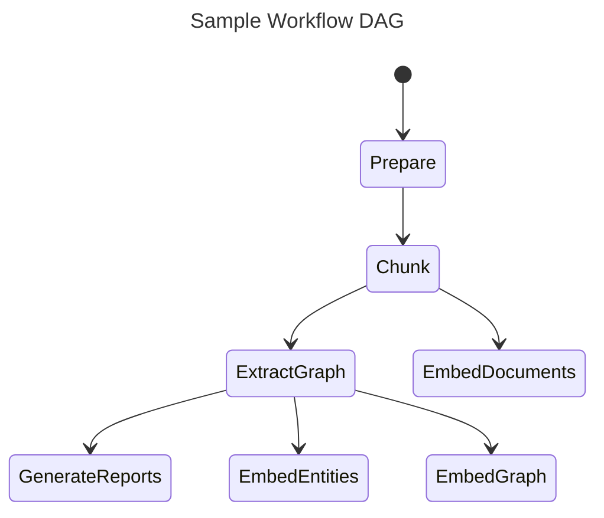

# Indexing Architecture 

## Key Concepts

### Knowledge Model

In order to support the GraphRAG system, the outputs of the indexing engine (in the Default Configuration Mode) are aligned to a knowledge model we call the _GraphRAG Knowledge Model_.
This model is designed to be an abstraction over the underlying data storage technology, and to provide a common interface for the GraphRAG system to interact with.
In normal use-cases the outputs of the GraphRAG Indexer would be loaded into a database system, and the GraphRAG's Query Engine would interact with the database using the knowledge model data-store types.

### Workflows

Because of the complexity of our data indexing tasks, we needed to be able to express our data pipeline as series of multiple, interdependent workflows.

### Dataframe Message Format

The primary unit of communication between workflows, and between workflow steps is an instance of `pandas.DataFrame`.
Although side-effects are possible, our goal is to be _data-centric_ and _table-centric_ in our approach to data processing.
This allows us to easily reason about our data, and to leverage the power of dataframe-based ecosystems.
Our underlying dataframe technology may change over time, but our primary goal is to support the workflow schema while retaining single-machine ease of use and developer ergonomics.

### LLM Caching

The GraphRAG library was designed with LLM interactions in mind, and a common setback when working with LLM APIs is various errors due to network latency, throttling, etc..
Because of these potential error cases, we've added a cache layer around LLM interactions.
When completion requests are made using the same input set (prompt and tuning parameters), we return a cached result if one exists.
This allows our indexer to be more resilient to network issues, to act idempotently, and to provide a more efficient end-user experience.
