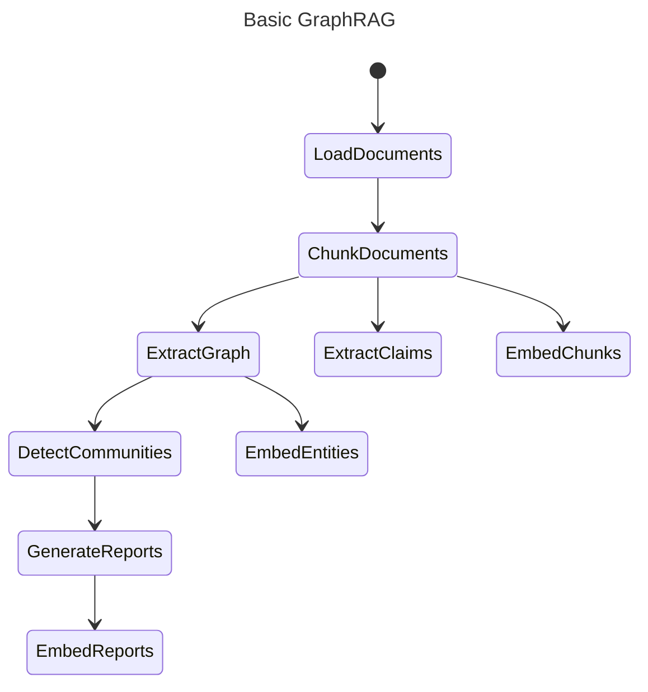

# 索引架构 

## 关键概念

### 知识模型

为了支持 GraphRAG 系统，索引引擎的输出（在默认配置模式下）与一个我们称为 _GraphRAG Knowledge Model_ 的知识模型保持一致。
该模型旨在作为底层数据存储技术之上的一种抽象，并为 GraphRAG 系统提供一个可交互的通用接口。

### 工作流

下面是 GraphRAG 的核心索引流水线。各个工作流的详细说明见 [dataflow](./default_dataflow.md) 页面。

### LLM 缓存

GraphRAG 库在设计时就考虑了 LLM 交互，而在使用 LLM API 时，一个常见的挫折是由于网络延迟、限流等导致的各种错误。
由于存在这些潜在的错误情况，我们在 LLM 交互外围增加了一层缓存。
当使用相同的输入集（提示词和调优参数）发起补全请求时，如果存在缓存结果，我们就返回该结果。
这使我们的索引器能够更好地抵御网络问题、以幂等方式运行，并为最终用户提供更高效的体验。

### 提供程序与工厂

GraphRAG 中的多个子系统使用工厂模式来注册和检索提供程序实现。这允许进行深度定制，以支持你自己的模型、存储等实现，即使这些实现尚未内置到核心库中。

以下子系统使用了工厂模式，允许你注册自己的实现：

- [language model](https://github.com/microsoft/graphrag/blob/main/packages/graphrag-llm/graphrag_llm/completion/completion_factory.py) - 实现你自己的 `chat` 和 `embed` 方法，以使用你所选择的模型提供程序，而不局限于内置的 LiteLLM 包装器
- [input reader](https://github.com/microsoft/graphrag/blob/main/packages/graphrag-input/graphrag_input/input_reader.py) - 实现你自己的输入文档读取器，以支持除 text、CSV 和 JSON 之外的文件类型
- [cache](https://github.com/microsoft/graphrag/blob/main/packages/graphrag-cache/graphrag_cache/cache_factory.py) - 除了我们提供的 file、blob 和 CosmosDB 之外，创建你自己的缓存存储位置
- [logger](https://github.com/microsoft/graphrag/blob/main/packages/graphrag/graphrag/logger/factory.py) - 除了内置的 file 和 blob 存储之外，创建你自己的日志写入位置
- [storage](https://github.com/microsoft/graphrag/blob/main/packages/graphrag-storage/graphrag_storage/tables/table_provider_factory.py) - 创建你自己的存储提供程序（数据库等），而不局限于内置的 file、blob 和 CosmosDB
- [vector store](https://github.com/microsoft/graphrag/blob/main/packages/graphrag-vectors/graphrag_vectors/vector_store_factory.py) - 实现你自己的向量存储，而不是使用内置的 lancedb、Azure AI Search 和 CosmosDB
- [pipeline + workflows](https://github.com/microsoft/graphrag/blob/main/packages/graphrag/graphrag/index/workflows/factory.py) - 使用自定义的 `run_workflow` 函数实现你自己的工作流步骤，或者注册整个流水线（具名工作流列表）

这些子系统对应的链接都指向工厂的源代码，其中包含默认内置实现的注册。此外，我们还对 [language models](../config/models.md) 进行了详细讨论，其中包含一个自定义提供程序的示例，以及一个演示自定义向量存储的 [sample notebook](../examples_notebooks/custom_vector_store.ipynb)。

所有这些工厂都允许你使用任意字符串名称来注册一个实现，甚至可以直接覆盖内置实现。