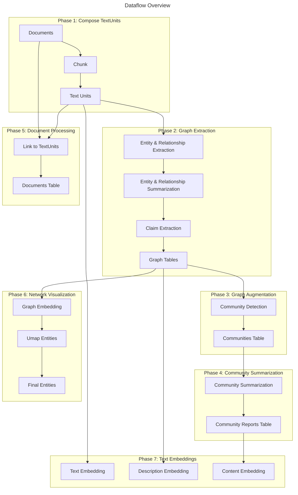
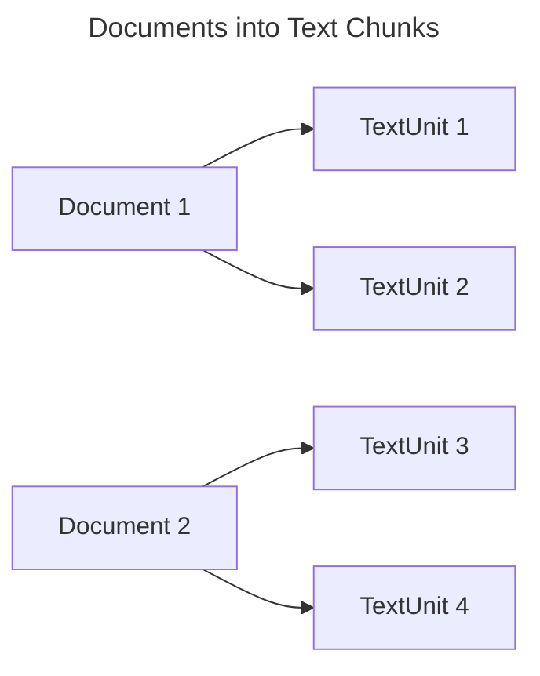
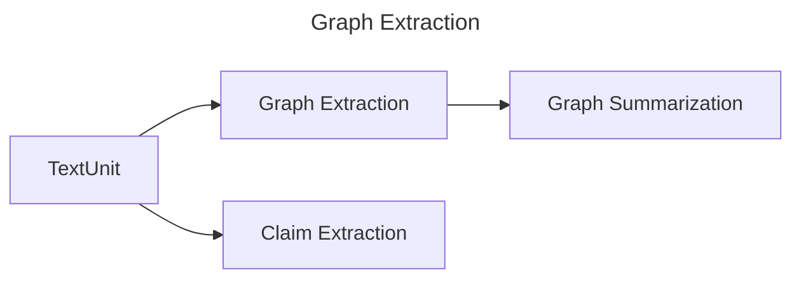
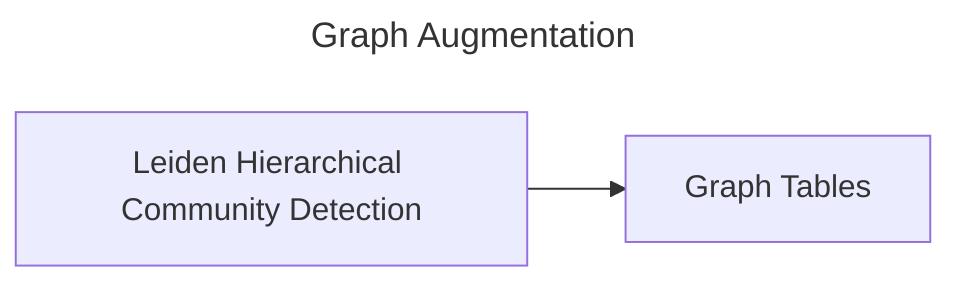
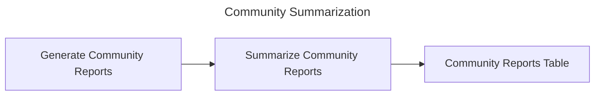
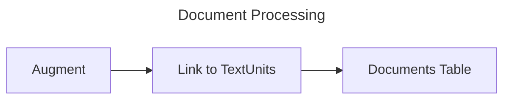
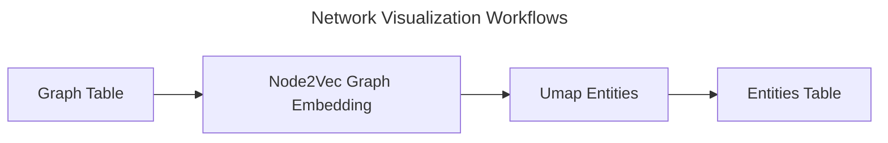
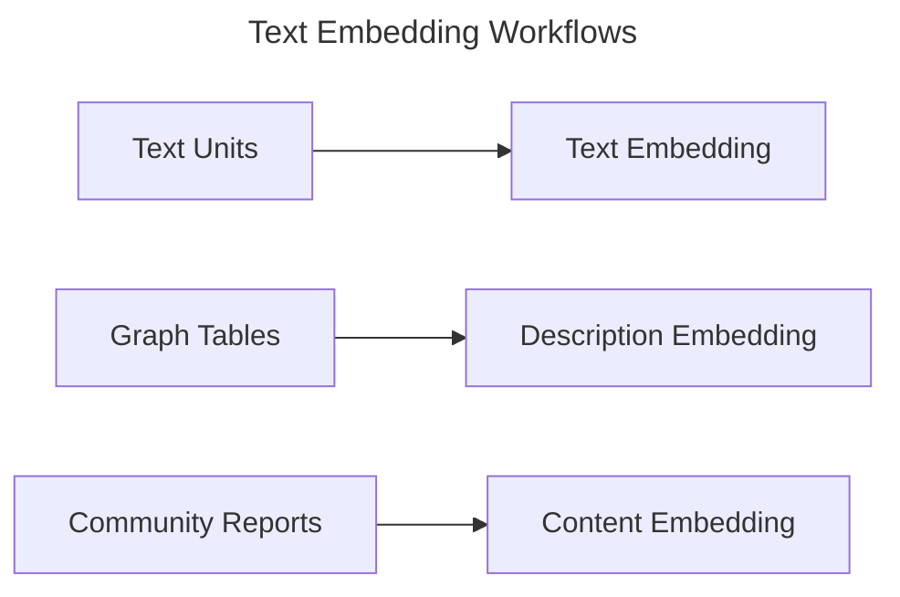

# Indexing Dataflow

## The GraphRAG Knowledge Model

The knowledge model is a specification for data outputs that conform to our data-model definition. You can find these definitions in the python/graphrag/graphrag/model folder within the GraphRAG repository. The following entity types are provided. The fields here represent the fields that are text-embedded by default.

- `Document` - An input document into the system. These either represent individual rows in a CSV or individual .txt file.
- `TextUnit` - A chunk of text to analyze. The size of these chunks, their overlap, and whether they adhere to any data boundaries may be configured below. A common use case is to set `CHUNK_BY_COLUMNS` to `id` so that there is a 1-to-many relationship between documents and TextUnits instead of a many-to-many.
- `Entity` - An entity extracted from a TextUnit. These represent people, places, events, or some other entity-model that you provide.
- `Relationship` - A relationship between two entities.
- `Covariate` - Extracted claim information, which contains statements about entities which may be time-bound.
- `Community` - Once the graph of entities and relationships is built, we perform hierarchical community detection on them to create a clustering structure.
- `Community Report` - The contents of each community are summarized into a generated report, useful for human reading and downstream search.

## The Default Configuration Workflow

Let's take a look at how the default-configuration workflow transforms text documents into the _GraphRAG Knowledge Model_. This page gives a general overview of the major steps in this process. To fully configure this workflow, check out the [configuration](../config/overview.md) documentation.

## Phase 1: Compose TextUnits

The first phase of the default-configuration workflow is to transform input documents into _TextUnits_. A _TextUnit_ is a chunk of text that is used for our graph extraction techniques. They are also used as source-references by extracted knowledge items in order to empower breadcrumbs and provenance by concepts back to their original source text.

The chunk size (counted in tokens), is user-configurable. By default this is set to 300 tokens, although we've had positive experience with 1200-token chunks using a single "glean" step. (A "glean" step is a follow-on extraction). Larger chunks result in lower-fidelity output and less meaningful reference texts; however, using larger chunks can result in much faster processing time.

The group-by configuration is also user-configurable. By default, we align our chunks to document boundaries, meaning that there is a strict 1-to-many relationship between Documents and TextUnits. In rare cases, this can be turned into a many-to-many relationship. This is useful when the documents are very short and we need several of them to compose a meaningful analysis unit (e.g. Tweets or a chat log)

## Phase 2: Graph Extraction

In this phase, we analyze each text unit and extract our graph primitives: _Entities_, _Relationships_, and _Claims_.
Entities and Relationships are extracted at once in our _entity_extract_ verb, and claims are extracted in our _claim_extract_ verb. Results are then combined and passed into following phases of the pipeline.

### Entity & Relationship Extraction

In this first step of graph extraction, we process each text-unit in order to extract entities and relationships out of the raw text using the LLM. The output of this step is a subgraph-per-TextUnit containing a list of **entities** with a _title_, _type_, and _description_, and a list of **relationships** with a _source_, _target_, and _description_.

These subgraphs are merged together - any entities with the same _title_ and _type_ are merged by creating an array of their descriptions. Similarly, any relationships with the same _source_ and _target_ are merged by creating an array of their descriptions.

### Entity & Relationship Summarization

Now that we have a graph of entities and relationships, each with a list of descriptions, we can summarize these lists into a single description per entity and relationship. This is done by asking the LLM for a short summary that captures all of the distinct information from each description. This allows all of our entities and relationships to have a single concise description.

### Claim Extraction (optional)

Finally, as an independent workflow, we extract claims from the source TextUnits. These claims represent positive factual statements with an evaluated status and time-bounds. These get exported as a primary artifact called **Covariates**.

Note: claim extraction is _optional_ and turned off by default. This is because claim extraction generally requires prompt tuning to be useful.

## Phase 3: Graph Augmentation

Now that we have a usable graph of entities and relationships, we want to understand their community structure. These give us explicit ways of understanding the topological structure of our graph.

### Community Detection

In this step, we generate a hierarchy of entity communities using the Hierarchical Leiden Algorithm. This method will apply a recursive community-clustering to our graph until we reach a community-size threshold. This will allow us to understand the community structure of our graph and provide a way to navigate and summarize the graph at different levels of granularity.

### Graph Tables

Once our graph augmentation steps are complete, the final **Entities**, **Relationships**, and **Communities** tables are exported.

## Phase 4: Community Summarization

At this point, we have a functional graph of entities and relationships and a hierarchy of communities for the entities.

Now we want to build on the communities data and generate reports for each community. This gives us a high-level understanding of the graph at several points of graph granularity. For example, if community A is the top-level community, we'll get a report about the entire graph. If the community is lower-level, we'll get a report about a local cluster.

### Generate Community Reports

In this step, we generate a summary of each community using the LLM. This will allow us to understand the distinct information contained within each community and provide a scoped understanding of the graph, from either a high-level or a low-level perspective. These reports contain an executive overview and reference the key entities, relationships, and claims within the community sub-structure.

### Summarize Community Reports

In this step, each _community report_ is then summarized via the LLM for shorthand use.

### Community Reports Table

At this point, some bookkeeping work is performed and we export the **Community Reports** tables.

## Phase 5: Document Processing

In this phase of the workflow, we create the _Documents_ table for the knowledge model.

### Augment with Columns (CSV Only)

If the workflow is operating on CSV data, you may configure your workflow to add additional fields to Documents output. These fields should exist on the incoming CSV tables. Details about configuring this can be found in the [configuration documentation](../config/overview.md).

### Link to TextUnits

In this step, we link each document to the text-units that were created in the first phase. This allows us to understand which documents are related to which text-units and vice-versa.

### Documents Table

At this point, we can export the **Documents** table into the knowledge Model.

## Phase 6: Network Visualization (optional)

In this phase of the workflow, we perform some steps to support network visualization of our high-dimensional vector spaces within our existing graphs. At this point there are two logical graphs at play: the _Entity-Relationship_ graph and the _Document_ graph.

### Graph Embedding

In this step, we generate a vector representation of our graph using the Node2Vec algorithm. This will allow us to understand the implicit structure of our graph and provide an additional vector-space in which to search for related concepts during our query phase.

### Dimensionality Reduction

For each of the logical graphs, we perform a UMAP dimensionality reduction to generate a 2D representation of the graph. This will allow us to visualize the graph in a 2D space and understand the relationships between the nodes in the graph. The UMAP embeddings are reduced to two dimensions as x/y coordinates.

## Phase 7: Text Embedding

For all artifacts that require downstream vector search, we generate text embeddings as a final step. These embeddings are written directly to a configured vector store. By default we embed entity descriptions, text unit text, and community report text.

