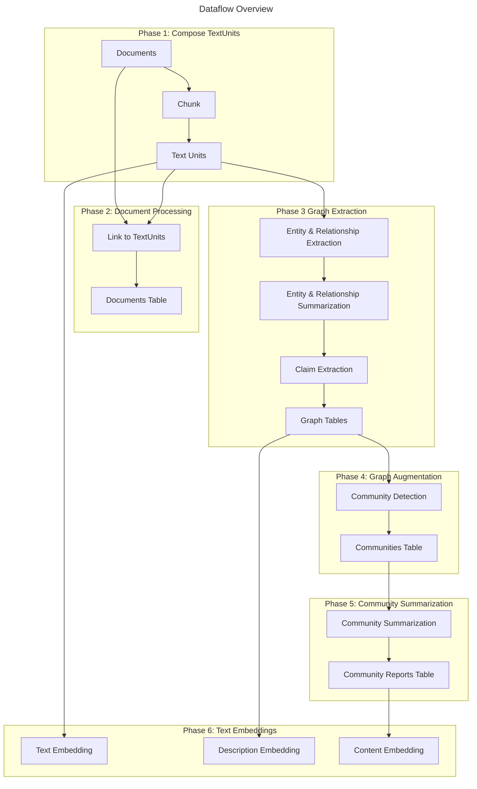
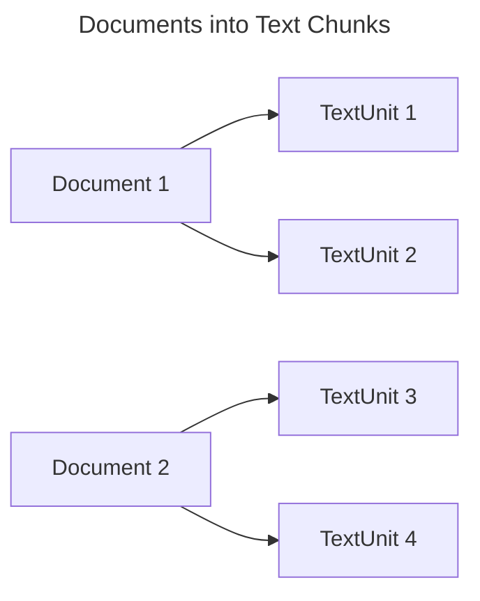
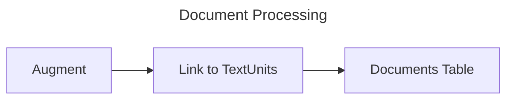
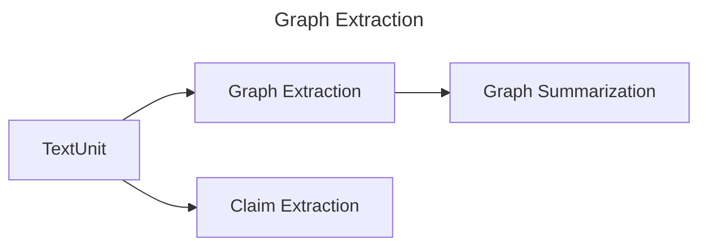
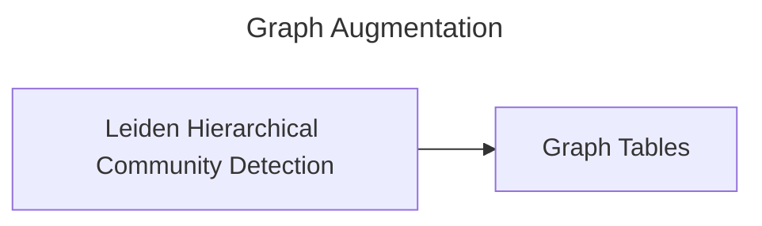
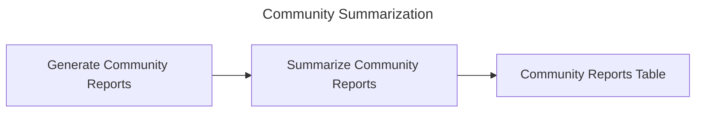
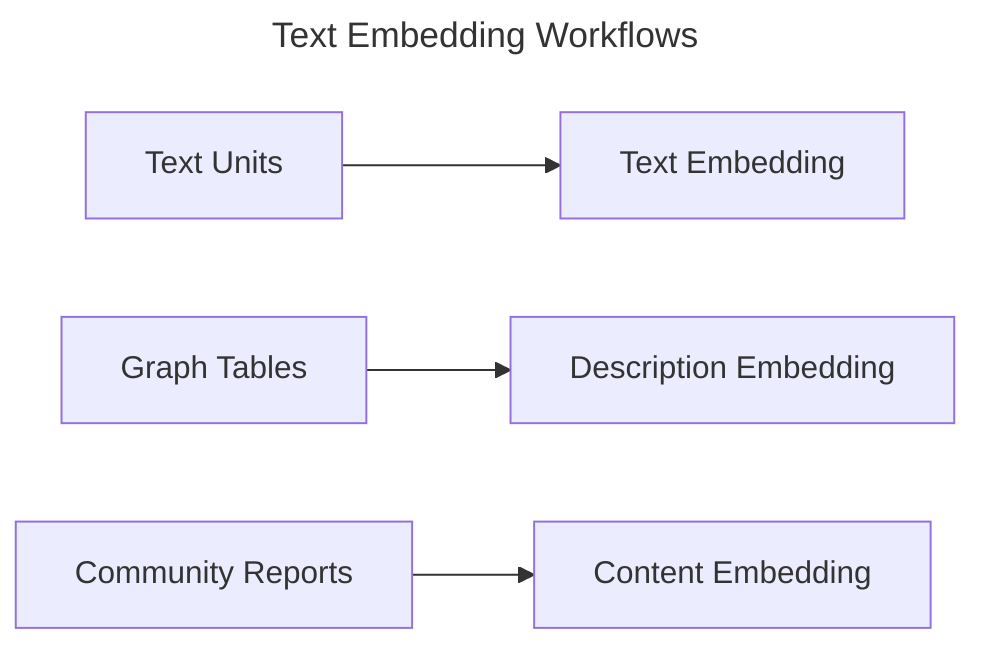

# 数据索引流程

## GraphRAG 知识模型

知识模型是对符合我们数据模型定义的数据输出的一种规范。你可以在 GraphRAG 仓库中的 `python/graphrag/graphrag/model` 文件夹内找到这些定义。提供了以下实体类型。这里的字段表示默认会进行文本嵌入的字段。

- `Document` - 系统中的输入文档。这些可以表示 CSV 中的单独行，或单独的 .txt 文件。
- `TextUnit` - 用于分析的一段文本。这些文本块的大小、重叠情况，以及它们是否遵循任何数据边界，都可以在下方进行配置。
- `Entity` - 从 TextUnit 中提取的实体。这些可以表示人物、地点、事件，或你提供的其他某种实体模型。
- `Relationship` - 两个实体之间的关系。
- `Covariate` - 提取出的声明信息，包含关于实体的陈述，这些陈述可能具有时间约束。
- `Community` - 在实体和关系构成的图建立之后，我们会对其执行分层社区检测，以创建聚类结构。
- `Community Report` - 每个社区的内容会被总结为生成的报告，便于人工阅读和下游搜索。

## 默认配置工作流

让我们来看一下默认配置工作流如何将文本文档转换为 _GraphRAG 知识模型_。本页对该过程中的主要步骤进行了总体概述。要完整配置此工作流，请参阅 [configuration](../config/overview.md) 文档。

## 第 1 阶段：构建 TextUnits

默认配置工作流的第一阶段是将输入文档转换为 _TextUnits_。_TextUnit_ 是一段用于图提取技术的文本。它们还会被提取出的知识项作为源引用使用，从而支持通过概念回溯到原始源文本的线索和溯源能力。

块大小（以 token 计）可由用户配置。默认设置为 1200 个 token。更大的文本块会导致输出保真度更低、引用文本意义更弱；但使用更大的文本块可以显著加快处理速度。

## 第 2 阶段：文档处理

在工作流的这一阶段，我们为知识模型创建 _Documents_ 表。最终文档不会在 GraphRAG 中被直接使用，但这一步会将它们与其组成的文本单元关联起来，以便在你自己的应用程序中进行溯源。

### 链接到 TextUnits

在这一步中，我们将每个文档链接到第一阶段中创建的文本单元。这使我们能够了解哪些文档与哪些文本单元相关，反之亦然。

### Documents 表

此时，我们可以将 **Documents** 表导出到知识模型中。

## 第 3 阶段：图提取

在这一阶段，我们分析每个文本单元并提取图的基本元素：_Entities_、_Relationships_ 和 _Claims_。
Entities 和 Relationships 会在我们的 _extract_graph_ 工作流中一次性提取，而 claims 会在我们的 _extract_claims_ 工作流中提取。随后结果会被合并并传递到流水线的后续阶段。

> 注意：如果你使用的是 [FastGraphRAG](https://microsoft.github.io/graphrag/index/methods/#fastgraphrag) 选项，实体和关系提取将使用 NLP 执行，以节省 LLM 资源，而声明提取将始终被跳过。

### 实体与关系提取

在图提取的第一步中，我们使用 LLM 处理每个文本单元，从原始文本中提取实体和关系。这一步的输出是每个 TextUnit 一个子图，其中包含一个 **entities** 列表，每个实体具有 _title_、_type_ 和 _description_，以及一个 **relationships** 列表，每个关系具有 _source_、_target_ 和 _description_。

随后这些子图会被合并——任何具有相同 _title_ 和 _type_ 的实体都会通过创建其描述数组的方式合并。类似地，任何具有相同 _source_ 和 _target_ 的关系也会通过创建其描述数组的方式合并。

### 实体与关系总结

现在我们已经有了一个实体和关系的图，并且每个实体和关系都带有描述列表，我们就可以将这些列表总结为每个实体和关系的一条单独描述。做法是请求 LLM 生成一个简短摘要，涵盖每条描述中的所有不同信息。这样，我们的所有实体和关系都将拥有一条简洁的单一描述。

### 声明提取（可选）

最后，作为一个独立工作流，我们从源 TextUnits 中提取声明。这些声明表示具有已评估状态和时间边界的正向事实陈述。它们会作为名为 **Covariates** 的主要产物导出。

注意：声明提取是 _可选_ 的，默认关闭。这是因为声明提取通常需要进行提示调优才会有用。

## 第 4 阶段：图增强

现在我们已经有了可用的实体与关系图，我们希望理解它们的社区结构。这为我们提供了理解图组织方式的明确途径。

### 社区检测

在这一步中，我们使用分层 Leiden 算法生成实体社区的层次结构。该方法会对图递归地应用社区聚类，直到达到社区大小阈值。这将使我们能够理解图的社区结构，并提供一种以不同粒度导航和总结图的方式。

### 图表

一旦图增强步骤完成，最终的 **Entities**、**Relationships** 和 **Communities** 表就会被导出。

## 第 5 阶段：社区总结

此时，我们已经拥有一个可用的实体与关系图，以及实体的社区层次结构。

现在我们希望基于社区数据，为每个社区生成报告。这使我们能够在图的多个粒度层级上获得对图的高层理解。例如，如果社区 A 是顶层社区，我们将获得关于整个图的报告。如果该社区处于较低层级，我们将获得关于局部簇的报告。

### 生成社区报告

在这一步中，我们使用 LLM 为每个社区生成摘要。这将使我们能够理解每个社区中包含的独特信息，并从高层或低层视角对图提供范围限定的理解。这些报告包含执行概览，并引用社区子结构中的关键实体、关系和声明。

### 总结社区报告

在这一步中，每个 _community report_ 随后都会通过 LLM 进一步总结，以便简写使用。

### Community Reports 表

此时，会执行一些记录整理工作，并导出 **Community Reports** 表。

## 第 6 阶段：文本嵌入

对于所有需要下游向量搜索的产物，我们在最后一步生成文本嵌入。这些嵌入会被直接写入已配置的向量存储。默认情况下，我们会嵌入实体描述、文本单元文本以及社区报告文本。

