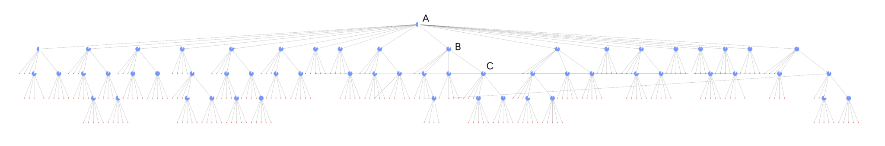

# DRIFT Search 🔎

## Combining Local and Global Search

GraphRAG is a technique that uses large language models (LLMs) to create knowledge graphs and summaries from unstructured text documents and leverages them to improve retrieval-augmented generation (RAG) operations on private datasets. It offers comprehensive global overviews of large, private troves of unstructured text documents while also enabling exploration of detailed, localized information. By using LLMs to create comprehensive knowledge graphs that connect and describe entities and relationships contained in those documents, GraphRAG leverages semantic structuring of the data to generate responses to a wide variety of complex user queries.

DRIFT search (Dynamic Reasoning and Inference with Flexible Traversal) builds upon Microsoft’s GraphRAG technique, combining characteristics of both global and local search to generate detailed responses in a method that balances computational costs with quality outcomes using our [drift search](https://github.com/microsoft/graphrag/blob/main//graphrag/query/structured_search/drift_search/) method.

## Methodology

<i><small>
Figure 1. An entire DRIFT search hierarchy highlighting the three core phases of the DRIFT search process. A (Primer): DRIFT compares the user’s query with the top K most semantically relevant community reports, generating a broad initial answer and follow-up questions to steer further exploration. B (Follow-Up): DRIFT uses local search to refine queries, producing additional intermediate answers and follow-up questions that enhance specificity, guiding the engine towards context-rich information. A glyph on each node in the diagram shows the confidence the algorithm has to continue the query expansion step.  C (Output Hierarchy): The final output is a hierarchical structure of questions and answers ranked by relevance, reflecting a balanced mix of global insights and local refinements, making the results adaptable and comprehensive.</small></i>

DRIFT Search introduces a new approach to local search queries by including community information in the search process. This greatly expands the breadth of the query’s starting point and leads to retrieval and usage of a far higher variety of facts in the final answer. This addition expands the GraphRAG query engine by providing a more comprehensive option for local search, which uses community insights to refine a query into detailed follow-up questions.

## Configuration

Below are the key parameters of the [DRIFTSearch class](https://github.com/microsoft/graphrag/blob/main//graphrag/query/structured_search/drift_search/search.py):

- `llm`: OpenAI model object to be used for response generation
- `context_builder`: [context builder](https://github.com/microsoft/graphrag/blob/main/graphrag/query/structured_search/drift_search/drift_context.py) object to be used for preparing context data from community reports and query information
- `config`: model to define the DRIFT Search hyperparameters. [DRIFT Config model](https://github.com/microsoft/graphrag/blob/main/graphrag/config/models/drift_search_config.py)
- `token_encoder`: token encoder for tracking the budget for the algorithm.
- `query_state`: a state object as defined in [Query State](https://github.com/microsoft/graphrag/blob/main/graphrag/query/structured_search/drift_search/state.py) that allows to track execution of a DRIFT Search instance, alongside follow ups and [DRIFT actions](https://github.com/microsoft/graphrag/blob/main/graphrag/query/structured_search/drift_search/action.py).

## How to Use

An example of a drift search scenario can be found in the following [notebook](../examples_notebooks/drift_search.ipynb).

## Learn More

For a more in-depth look at the DRIFT search method, please refer to our [DRIFT Search blog post](https://www.microsoft.com/en-us/research/blog/introducing-drift-search-combining-global-and-local-search-methods-to-improve-quality-and-efficiency/)
