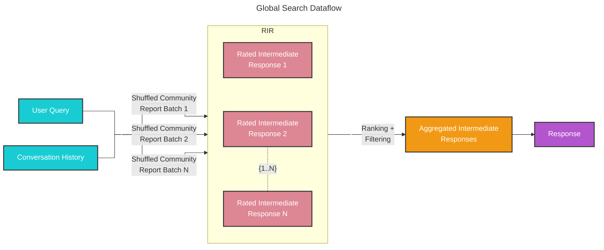

# Global Search 🔎

## Whole Dataset Reasoning

Baseline RAG struggles with queries that require aggregation of information across the dataset to compose an answer. Queries such as “What are the top 5 themes in the data?” perform terribly because baseline RAG relies on a vector search of semantically similar text content within the dataset. There is nothing in the query to direct it to the correct information.

However, with GraphRAG we can answer such questions, because the structure of the LLM-generated knowledge graph tells us about the structure (and thus themes) of the dataset as a whole. This allows the private dataset to be organized into meaningful semantic clusters that are pre-summarized. Using our [global search](https://github.com/microsoft/graphrag/blob/main//graphrag/query/structured_search/global_search/) method, the LLM uses these clusters to summarize these themes when responding to a user query.

## Methodology

Given a user query and, optionally, the conversation history, the global search method uses a collection of LLM-generated community reports from a specified level of the graph's community hierarchy as context data to generate response in a map-reduce manner. At the `map` step, community reports are segmented into text chunks of pre-defined size. Each text chunk is then used to produce an intermediate response containing a list of point, each of which is accompanied by a numerical rating indicating the importance of the point. At the `reduce` step, a filtered set of the most important points from the intermediate responses are aggregated and used as the context to generate the final response. 

The quality of the global search’s response can be heavily influenced by the level of the community hierarchy chosen for sourcing community reports. Lower hierarchy levels, with their detailed reports, tend to yield more thorough responses, but may also increase the time and LLM resources needed to generate the final response due to the volume of reports.

## Configuration

Below are the key parameters of the [GlobalSearch class](https://github.com/microsoft/graphrag/blob/main//graphrag/query/structured_search/global_search/search.py):

* `llm`: OpenAI model object to be used for response generation
* `context_builder`: [context builder](https://github.com/microsoft/graphrag/blob/main//graphrag/query/structured_search/global_search/community_context.py) object to be used for preparing context data from community reports
* `map_system_prompt`: prompt template used in the `map` stage. Default template can be found at [map_system_prompt](https://github.com/microsoft/graphrag/blob/main//graphrag/prompts/query/global_search_map_system_prompt.py)
* `reduce_system_prompt`: prompt template used in the `reduce` stage, default template can be found at [reduce_system_prompt](https://github.com/microsoft/graphrag/blob/main//graphrag/prompts/query/global_search_reduce_system_prompt.py)
* `response_type`: free-form text describing the desired response type and format (e.g., `Multiple Paragraphs`, `Multi-Page Report`)
* `allow_general_knowledge`: setting this to True will include additional instructions to the `reduce_system_prompt` to prompt the LLM to incorporate relevant real-world knowledge outside of the dataset. Note that this may increase hallucinations, but can be useful for certain scenarios. Default is False
*`general_knowledge_inclusion_prompt`: instruction to add to the `reduce_system_prompt` if `allow_general_knowledge` is enabled. Default instruction can be found at [general_knowledge_instruction](https://github.com/microsoft/graphrag/blob/main//graphrag/prompts/query/global_search_knowledge_system_prompt.py)
* `max_data_tokens`: token budget for the context data
* `map_llm_params`: a dictionary of additional parameters (e.g., temperature, max_tokens) to be passed to the LLM call at the `map` stage
* `reduce_llm_params`: a dictionary of additional parameters (e.g., temperature, max_tokens) to passed to the LLM call at the `reduce` stage
* `context_builder_params`: a dictionary of additional parameters to be passed to the [`context_builder`](https://github.com/microsoft/graphrag/blob/main//graphrag/query/structured_search/global_search/community_context.py) object when building context window for the `map` stage.
* `concurrent_coroutines`: controls the degree of parallelism in the `map` stage.
* `callbacks`: optional callback functions, can be used to provide custom event handlers for LLM's completion streaming events

## How to Use

An example of a global search scenario can be found in the following [notebook](../examples_notebooks/global_search.ipynb).