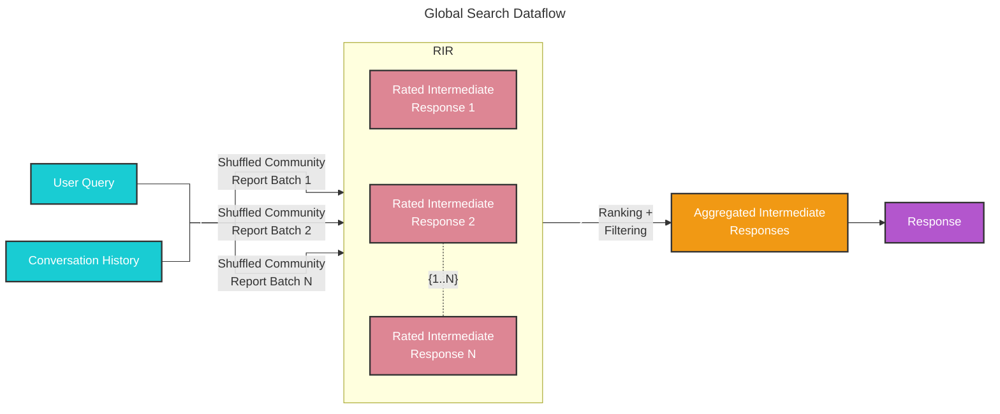

# 全局搜索 🔎

## 整个数据集推理

基线 RAG 难以处理那些需要对整个数据集中的信息进行聚合才能组成答案的查询。像“数据中的前 5 个主题是什么？”这样的查询表现很差，因为基线 RAG 依赖于在数据集中对语义相似的文本内容进行向量搜索。查询本身并没有任何内容能引导它找到正确的信息。

然而，借助 GraphRAG，我们可以回答这类问题，因为由 LLM 生成的知识图谱结构能够告诉我们整个数据集的结构（以及因此得出的主题）。这使得私有数据集能够被组织成有意义的语义簇，并提前完成摘要。使用我们的[全局搜索](https://github.com/microsoft/graphrag/blob/main/packages/graphrag/graphrag/query/structured_search/global_search/)方法时，LLM 会在响应用户查询时利用这些簇来总结这些主题。

## 方法论

给定一个用户查询以及可选的对话历史，全局搜索方法会使用来自图社区层级结构中指定层级的一组由 LLM 生成的社区报告作为上下文数据，以 map-reduce 的方式生成响应。在 `map` 步骤中，社区报告会被分割为预定义大小的文本块。随后，每个文本块都会用于生成一个中间响应，其中包含一个要点列表，每个要点都附带一个数值评分，用于表示该要点的重要性。在 `reduce` 步骤中，会从中间响应中过滤并聚合一组最重要的要点，并将其作为上下文来生成最终响应。 

全局搜索响应的质量会在很大程度上受到用于获取社区报告的社区层级结构层级选择的影响。较低的层级由于报告更详细，往往能产生更全面的响应，但由于报告数量较多，也可能增加生成最终响应所需的时间和 LLM 资源。

## 配置

以下是 [GlobalSearch class](https://github.com/microsoft/graphrag/blob/main/packages/graphrag/graphrag/query/structured_search/global_search/search.py) 的关键参数：

* `model`：用于生成响应的语言模型聊天补全对象
* `context_builder`：用于从社区报告准备上下文数据的[上下文构建器](https://github.com/microsoft/graphrag/blob/main/packages/graphrag/graphrag/query/structured_search/global_search/community_context.py)对象
* `map_system_prompt`：在 `map` 阶段使用的提示模板。默认模板可在 [map_system_prompt](https://github.com/microsoft/graphrag/blob/main/packages/graphrag/graphrag/prompts/query/global_search_map_system_prompt.py) 中找到
* `reduce_system_prompt`：在 `reduce` 阶段使用的提示模板，默认模板可在 [reduce_system_prompt](https://github.com/microsoft/graphrag/blob/main/packages/graphrag/graphrag/prompts/query/global_search_reduce_system_prompt.py) 中找到
* `response_type`：自由格式文本，用于描述期望的响应类型和格式（例如：`Multiple Paragraphs`、`Multi-Page Report`）
* `allow_general_knowledge`：将其设置为 True 会向 `reduce_system_prompt` 添加额外指令，以提示 LLM 融合数据集之外的相关现实世界知识。请注意，这可能会增加幻觉，但在某些场景下会很有用。默认值为 False
*`general_knowledge_inclusion_prompt`：如果启用了 `allow_general_knowledge`，则添加到 `reduce_system_prompt` 的指令。默认指令可在 [general_knowledge_instruction](https://github.com/microsoft/graphrag/blob/main/packages/graphrag/graphrag/prompts/query/global_search_knowledge_system_prompt.py) 中找到
* `max_data_tokens`：上下文数据的 token 预算
* `map_llm_params`：一个字典，包含将在 `map` 阶段传递给 LLM 调用的附加参数（例如 temperature、max_tokens）
* `reduce_llm_params`：一个字典，包含将传递给 `reduce` 阶段 LLM 调用的附加参数（例如 temperature、max_tokens）
* `context_builder_params`：一个字典，包含在为 `map` 阶段构建上下文窗口时传递给 [`context_builder`](https://github.com/microsoft/graphrag/blob/main/packages/graphrag/graphrag/query/structured_search/global_search/community_context.py) 对象的附加参数。
* `concurrent_coroutines`：控制 `map` 阶段的并行度。
* `callbacks`：可选的回调函数，可用于为 LLM 的补全流式事件提供自定义事件处理器

## 如何使用

可在以下[notebook](../examples_notebooks/global_search.ipynb)中找到一个全局搜索场景示例。