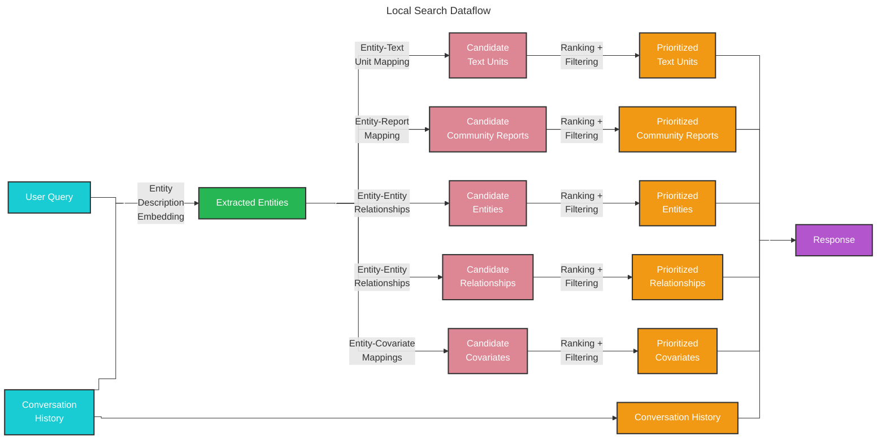

# Local Search 🔎

## Entity-based Reasoning

The [local search](https://github.com/microsoft/graphrag/blob/main//graphrag/query/structured_search/local_search/) method combines structured data from the knowledge graph with unstructured data from the input documents to augment the LLM context with relevant entity information at query time. It is well-suited for answering questions that require an understanding of specific entities mentioned in the input documents (e.g., “What are the healing properties of chamomile?”).

## Methodology

Given a user query and, optionally, the conversation history, the local search method identifies a set of entities from the knowledge graph that are semantically-related to the user input. These entities serve as access points into the knowledge graph, enabling the extraction of further relevant details such as connected entities, relationships, entity covariates, and community reports. Additionally, it also extracts relevant text chunks from the raw input documents that are associated with the identified entities. These candidate data sources are then prioritized and filtered to fit within a single context window of pre-defined size, which is used to generate a response to the user query.

## Configuration

Below are the key parameters of the [LocalSearch class](https://github.com/microsoft/graphrag/blob/main//graphrag/query/structured_search/local_search/search.py):

* `llm`: OpenAI model object to be used for response generation
* `context_builder`: [context builder](https://github.com/microsoft/graphrag/blob/main//graphrag/query/structured_search/local_search/mixed_context.py) object to be used for preparing context data from collections of knowledge model objects
* `system_prompt`: prompt template used to generate the search response. Default template can be found at [system_prompt](https://github.com/microsoft/graphrag/blob/main//graphrag/prompts/query/local_search_system_prompt.py)
* `response_type`: free-form text describing the desired response type and format (e.g., `Multiple Paragraphs`, `Multi-Page Report`)
* `llm_params`: a dictionary of additional parameters (e.g., temperature, max_tokens) to be passed to the LLM call
* `context_builder_params`: a dictionary of additional parameters to be passed to the [`context_builder`](https://github.com/microsoft/graphrag/blob/main//graphrag/query/structured_search/local_search/mixed_context.py) object when building context for the search prompt
* `callbacks`: optional callback functions, can be used to provide custom event handlers for LLM's completion streaming events

## How to Use

An example of a local search scenario can be found in the following [notebook](../examples_notebooks/local_search.ipynb).

