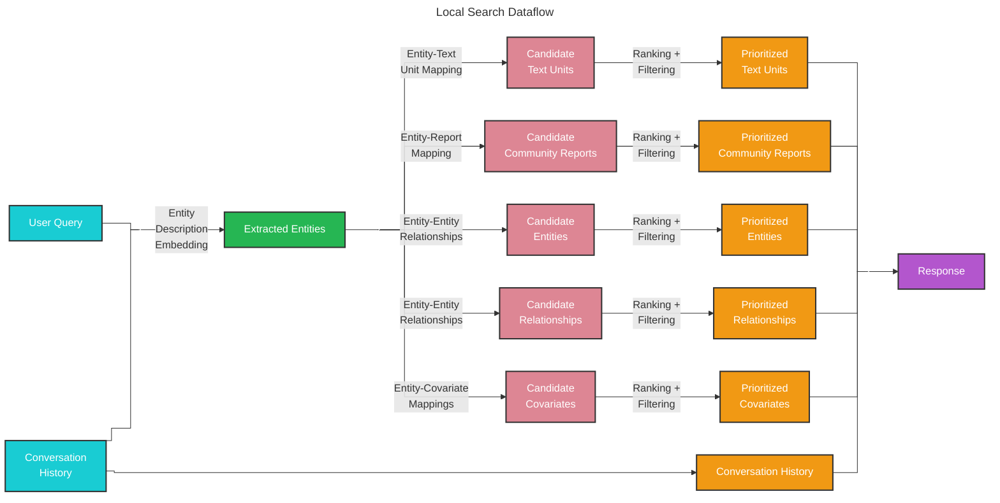

# 本地搜索 🔎

## 基于实体的推理

[本地搜索](https://github.com/microsoft/graphrag/blob/main/packages/graphrag/graphrag/query/structured_search/local_search/) 方法将知识图谱中的结构化数据与输入文档中的非结构化数据相结合，在查询时使用相关实体信息增强 LLM 上下文。它非常适合回答那些需要理解输入文档中提及的特定实体的问题（例如：“洋甘菊有哪些疗愈特性？”）。

## 方法论

给定用户查询以及可选的对话历史，本地搜索方法会从知识图谱中识别出一组与用户输入在语义上相关的实体。这些实体充当进入知识图谱的访问点，从而能够提取更多相关细节，例如相连实体、关系、实体协变量以及社区报告。此外，它还会从原始输入文档中提取与已识别实体相关的文本片段。随后，这些候选数据源会经过优先级排序和过滤，以适配预定义大小的单个上下文窗口，并用该窗口来生成对用户查询的响应。

## 配置

以下是 [LocalSearch class](https://github.com/microsoft/graphrag/blob/main/packages/graphrag/graphrag/query/structured_search/local_search/search.py) 的关键参数：

* `model`：用于生成响应的语言模型聊天补全对象
* `context_builder`：用于从知识模型对象集合中准备上下文数据的 [context builder](https://github.com/microsoft/graphrag/blob/main/packages/graphrag/graphrag/query/structured_search/local_search/mixed_context.py) 对象
* `system_prompt`：用于生成搜索响应的提示模板。默认模板可在 [system_prompt](https://github.com/microsoft/graphrag/blob/main/packages/graphrag/graphrag/prompts/query/local_search_system_prompt.py) 中找到
* `response_type`：描述所需响应类型和格式的自由文本（例如，`Multiple Paragraphs`、`Multi-Page Report`）
* `llm_params`：一个附加参数字典（例如，temperature、max_tokens），会传递给 LLM 调用
* `context_builder_params`：一个附加参数字典，在为搜索提示构建上下文时会传递给 [`context_builder`](https://github.com/microsoft/graphrag/blob/main/packages/graphrag/graphrag/query/structured_search/local_search/mixed_context.py) 对象
* `callbacks`：可选的回调函数，可用于为 LLM 的补全流式事件提供自定义事件处理器

## 如何使用

本地搜索场景的示例可在以下 [notebook](../examples_notebooks/local_search.ipynb) 中找到。