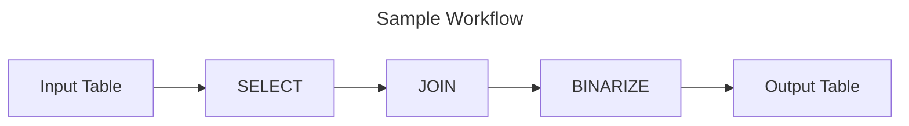
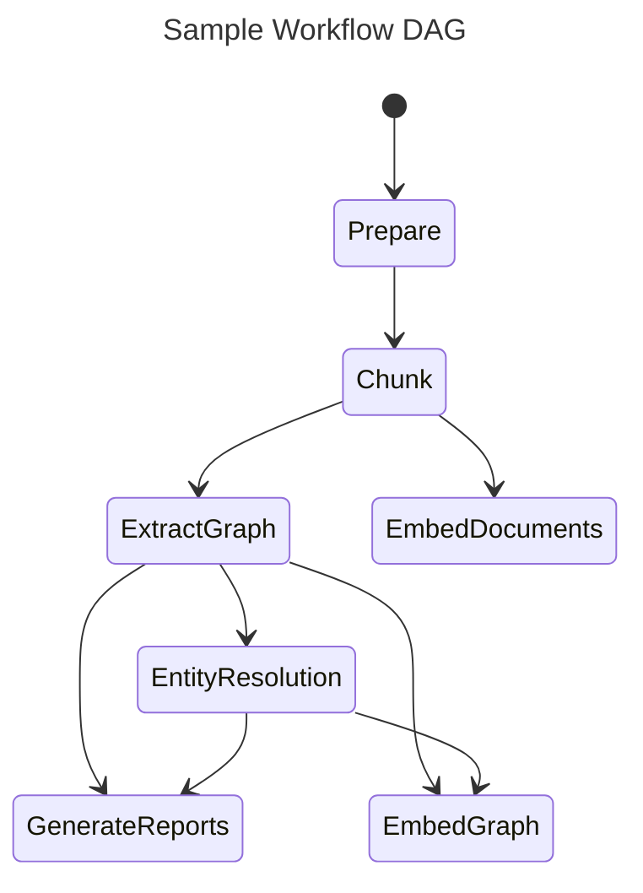

## Key Concepts

### Knowledge Model

In order to support the GraphRAG system, the outputs of the indexing engine (in the Default Configuration Mode) are aligned to a knowledge model we call the _GraphRAG Knowledge Model_.
This model is designed to be an abstraction over the underlying data storage technology, and to provide a common interface for the GraphRAG system to interact with.
In normal use-cases the outputs of the GraphRAG Indexer would be loaded into a database system, and the GraphRAG's Query Engine would interact with the database using the knowledge model data-store types.

### DataShaper Workflows

GraphRAG's Indexing Pipeline is built on top of our open-source library, [DataShaper](https://github.com/microsoft/datashaper).
DataShaper is a data processing library that allows users to declaratively express data pipelines, schemas, and related assets using well-defined schemas.
DataShaper has implementations in JavaScript and Python, and is designed to be extensible to other languages.

One of the core resource types within DataShaper is a [Workflow](https://github.com/microsoft/datashaper/blob/main/javascript/schema/src/workflow/WorkflowSchema.ts).
Workflows are expressed as sequences of steps, which we call [verbs](https://github.com/microsoft/datashaper/blob/main/javascript/schema/src/workflow/verbs.ts).
Each step has a verb name and a configuration object.
In DataShaper, these verbs model relational concepts such as SELECT, DROP, JOIN, etc.. Each verb transforms an input data table, and that table is passed down the pipeline.

### LLM-based Workflow Steps

GraphRAG's Indexing Pipeline implements a handful of custom verbs on top of the standard, relational verbs that our DataShaper library provides. These verbs give us the ability to augment text documents with rich, structured data using the power of LLMs such as GPT-4. We utilize these verbs in our standard workflow to extract entities, relationships, claims, community structures, and community reports and summaries. This behavior is customizable and can be extended to support many kinds of AI-based data enrichment and extraction tasks.

### Workflow Graphs

Because of the complexity of our data indexing tasks, we needed to be able to express our data pipeline as series of multiple, interdependent workflows.
In the GraphRAG Indexing Pipeline, each workflow may define dependencies on other workflows, effectively forming a directed acyclic graph (DAG) of workflows, which is then used to schedule processing.

### Dataframe Message Format

The primary unit of communication between workflows, and between workflow steps is an instance of `pandas.DataFrame`.
Although side-effects are possible, our goal is to be _data-centric_ and _table-centric_ in our approach to data processing.
This allows us to easily reason about our data, and to leverage the power of dataframe-based ecosystems.
Our underlying dataframe technology may change over time, but our primary goal is to support the DataShaper workflow schema while retaining single-machine ease of use and developer ergonomics.

### LLM Caching

The GraphRAG library was designed with LLM interactions in mind, and a common setback when working with LLM APIs is various errors errors due to network latency, throttling, etc..
Because of these potential error cases, we've added a cache layer around LLM interactions.
When completion requests are made using the same input set (prompt and tuning parameters), we return a cached result if one exists.
This allows our indexer to be more resilient to network issues, to act idempotently, and to provide a more efficient end-user experience.
