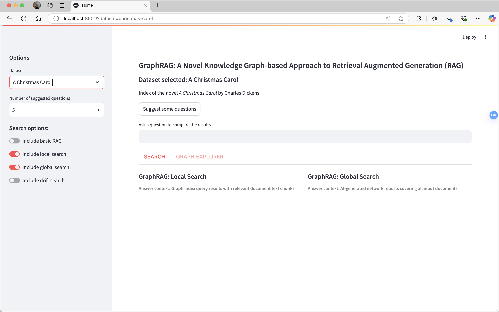
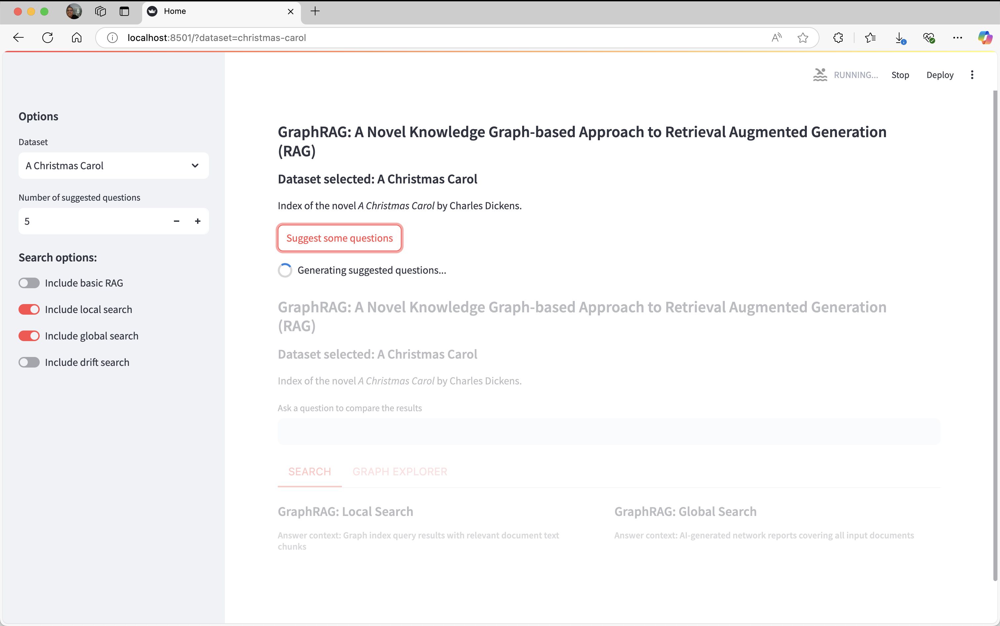
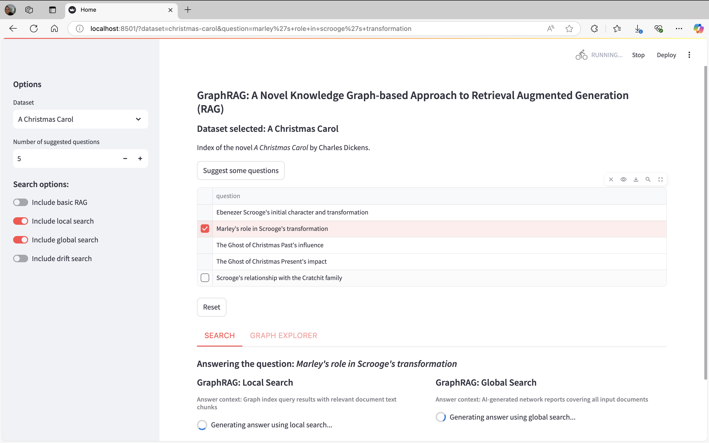
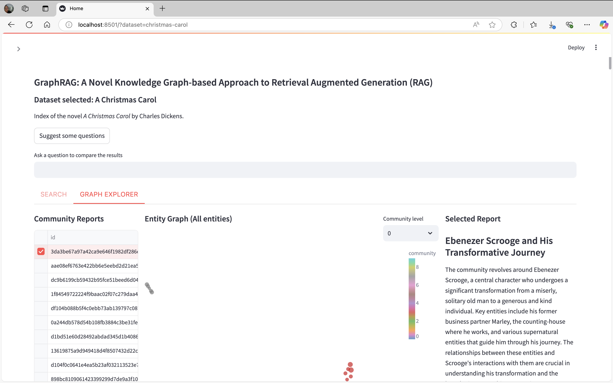

# Unified Search
Unified demo for GraphRAG search comparisons.

⚠️ This app is maintained for demo/experimental purposes and is not supported. Issue filings on the GraphRAG repo may not be addressed.

## Requirements:
- Python 3.11
- Poetry
    
This sample app is not published to pypi, so you'll need to clone the GraphRAG repo and run from this folder.

We recommend always using a virtual environment:

- `python -m venv ./venv`
- `source ./venv/bin/activate`

## Run index
Use GraphRAG to index your dataset before running Unified Search. We recommend starting with the [Getting Started guide](https://microsoft.github.io/graphrag/get_started/). You need to run GraphRAG indexing with graph embedding umap enabled to use the functionalities of Unified Search. 
``` yaml
embed_graph:
  enabled: true

umap:
  enabled: true
```

## Datasets
Unified Search supports multiple GraphRAG indexes by using a directory listing file. Create a `listing.json` file in the root folder where all your datasets are stored (locally or in blob storage), with the following format (one entry per dataset):

```json
[{
    "key": "<key_to_identify_dataset_1>",
    "path": "<path_to_dataset_1>",
    "name": "<name_to_identify_dataset_1>",
    "description": "<description_for_dataset_1>",
    "community_level": "<integer for community level you want to filter>"
},{
    "key": "<key_to_identify_dataset_2>",
    "path": "<path_to_dataset_2>",
    "name": "<name_to_identify_dataset_2>",
    "description": "<description_for_dataset_2>",
    "community_level": "<integer for community level you want to filter>"
}]
```

For example, if you have a folder of GraphRAG indexes called "projects" and inside that you ran the Getting Started instructions, your listing.json in the projects folder could look like:
```json
[{
    "key": "ragtest-demo",
    "path": "ragtest",
    "name": "A Christmas Carol",
    "description": "Getting Started index of the novel A Christmas Carol",
    "community_level": 2
}]
```

### Data Source Configuration 
The expected format of the projects folder will be the following:
- projects_folder
    - listing.json
    - dataset_1
        - settings.yaml
        - .env (optional if you declare your environment variables elsewhere)
        - output
        - prompts
    - dataset_2
        - settings.yaml
        - .env (optional if you declare your environment variables elsewhere)
        - output
        - prompts
    - ...

Note: Any other folder inside each dataset folder will be ignored but will not affect the app. Also, only the datasets declared inside listing.json will be used for Unified Search. 

## Storing your datasets
You can host Unified Search datasets locally or in a blob.

### 1. Local data folder
1. Create a local folder with all your data and config as described above
2. Tell the app where your folder is using an absolute path with the following environment variable:
- `DATA_ROOT` = `<data_folder_absolute_path>`

### 2. Azure Blob Storage
1. If you want to use Azure Blob Storage, create a blob storage account with a "data" container and upload all your data and config as described above
2. Run `az login` and select an account that has read permissions on that storage
3. You need to tell the app what blob account to use using the following environment variable:
- `BLOB_ACCOUNT_NAME` = `<blob_storage_name>`
4. (optional) In your blob account you need to create a container where your projects live. We default this to `data` as mentioned in step one, but if you want to use something else you can set:
- `BLOB_CONTAINER_NAME` = `<blob_container_with_projects>`


# Run the app

Install all the dependencies: `poetry install`

Run the project using streamlit: `poetry run poe start`

# How to use it



## Configuration panel (left panel)
When you run the app you will see two main panels at the beginning. The left panel provides several configuration options for the app and this panel can be closed:
1. **Datasets**: Here all the datasets you defined inside the listing.json file are shown in order inside the dropdown.
2. **Number of suggested questions**: this option let the user to choose how many suggested question can be generated.
3. **Search options**: This section allows to choose which searches to use in the app. At least one search should be enabled to use the app.

## Searches panel (right panel)
In the right panel you have several functionalities. 
1. At the top you can see general information related to the chosen dataset (name and description).
2. Below the dataset information there is a button labeled "Suggest some questions" which analyzes the dataset using global search and generates the most important questions (the number of questions generated is the amount set in the configuration panel). If you want to select a question generated you have to click the checkbox at the left side of the question to select it. 
3. A textbox that it is labeled as "Ask a question to compare the results" where you can type the question that you want to send.
4. Two tabs called Search and Graph Explorer:
    1. Search: Here all the searches results are displayed with their citations.
    2. Graph Explorer: This tab is divided in three sections: Community Reports, Entity Graph and Selected Report. 

##### Suggest some question clicked


##### Selected question clicked


##### Graph Explorer tab



